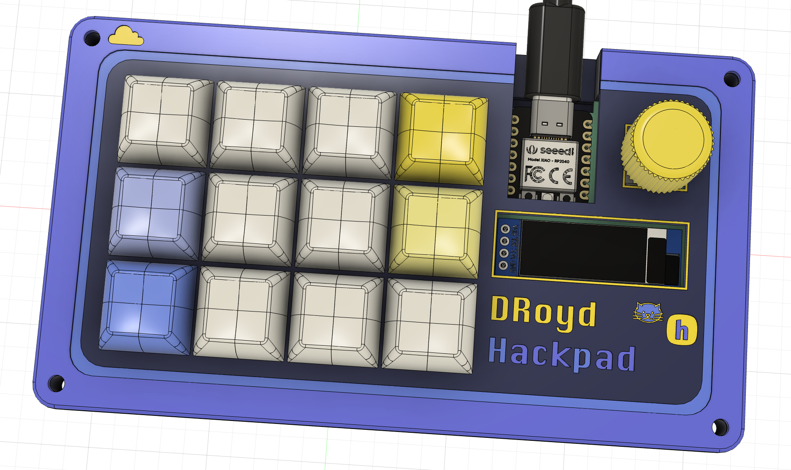
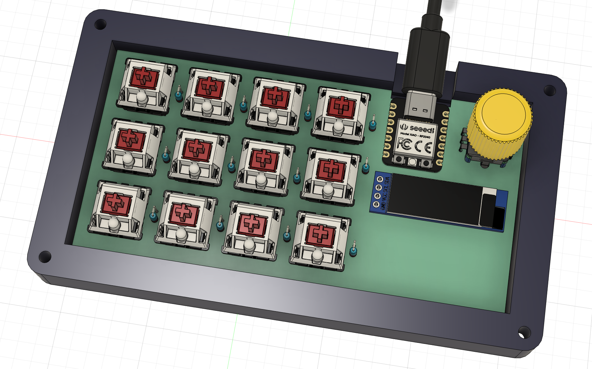
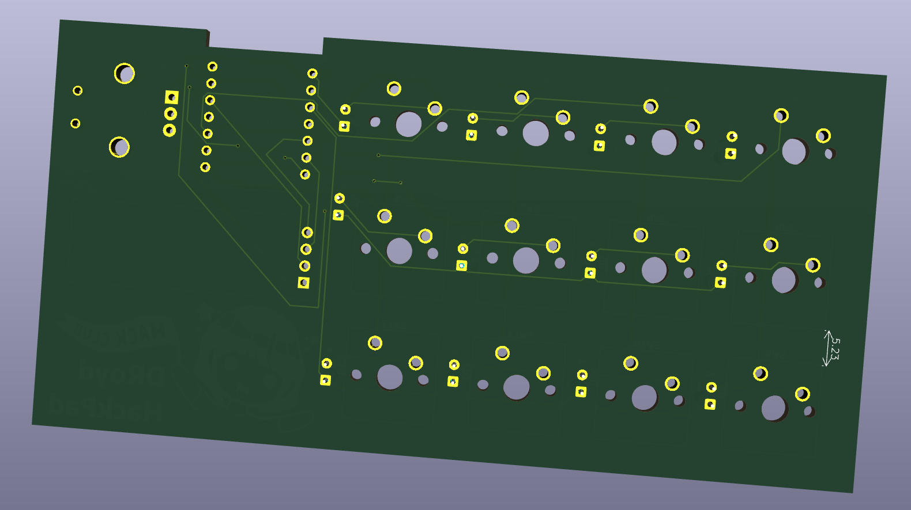
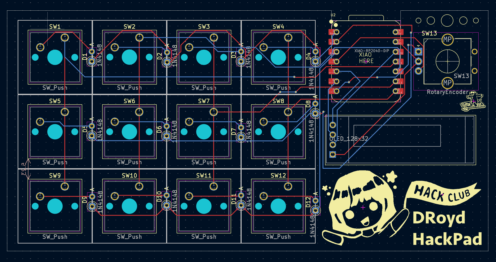
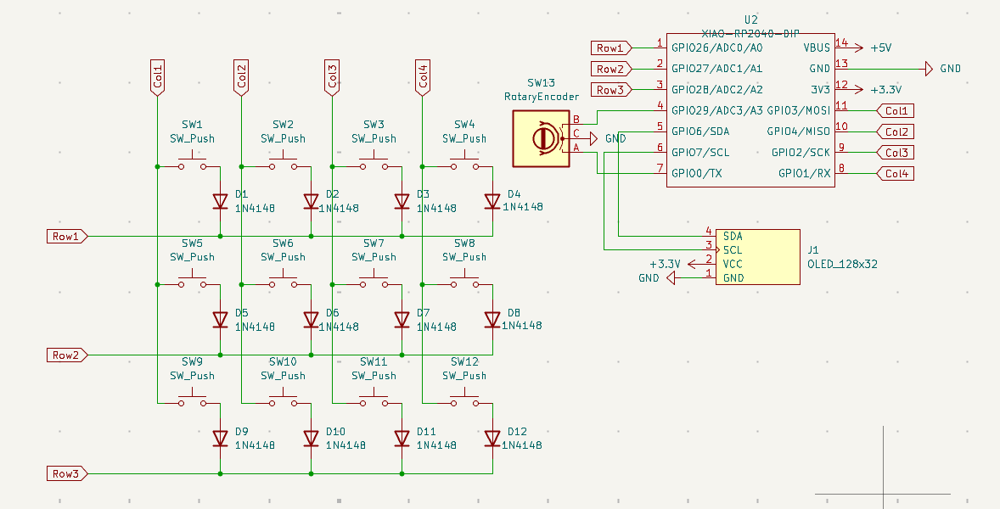

# DroydPad
Here is my hackpad for Athena/Highway in Hack Club! It includes 12 switches, an oled and a rotary encoder.
- You can find the pcb gerbers and 3d print files in the sub folders. Please print my case white so I can paint it later.
- My firmware turns the hackpad into a T-9 typing pad or a shortcuts simplifier (don't have to hold down multiple keys at once). The OLED displays what is currently happening and the rotary encoder changes the brightness of the screen.
- Pictures of my schematic and cad can be found in the general_files

  

# Case CAD
Used Autodesk Fusion. In the cad_files folder I have attached my main cad file, my components (including the files needed to print the case) and components I borrowed from online (credits are below).

  
  

# Schematic for PCB
- I designed the PCB in Kicad. In the kicad folder of the repository I attached my primary project files for the PCB.

  
  

  

  

## BOM:
These should be the necessary parts to assemble this project.
#### From Kit
- 1x Seeed Studio Xiao RP2040
- 1x EC11E Rotary Encoder
- 1x 0.91" SSD1306 OLED screen
- 12x Cherry MX style switches
- 12x Blank DSA keycaps (white, will color)
- 12x DO-35 diodes
- 4x M3x16mm screws
- 4x M3x5mx4mm heatset inserts

#### For Print
- 1x Base Frame of Case
- 1x Top Cover of Case
- 1x Rotary Encoder Knob

+ the PCB of course.

## CREDITS
Online Components Links:
Cherry MX Switch Model -> https://grabcad.com/library/cherry-mx-red-switch-1 by Baco
DSA Keycap Model -> https://grabcad.com/library/dsa-keycap-for-cherry-mx-switches-1 by zim cad
USB-C Connector Model -> https://grabcad.com/library/usb-c-bulkhead-connector-1 by Nelson Stoldt
EC11 Rotary Encoder Model -> https://grabcad.com/library/ec11-rotary-encoder-with-switch-1 by Anthony Berkow
EC11 Rotary Encoder Knob Model -> https://www.printables.com/model/1000044-ec11-encoder-knob/files by Kea Workshop
Xiao Model -> https://grabcad.com/library/seeed-studio-xiao-rp2040-1 by mirac gulgonul
OLED 0.91 128x32 Model -> https://grabcad.com/library/oled-0-91-128x32-1 by Stilet Fox
